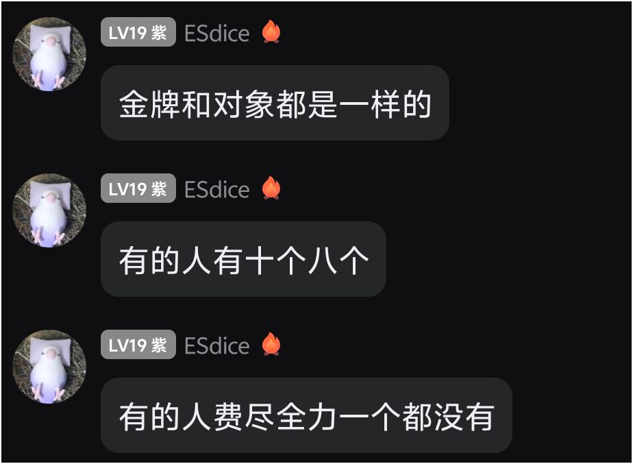
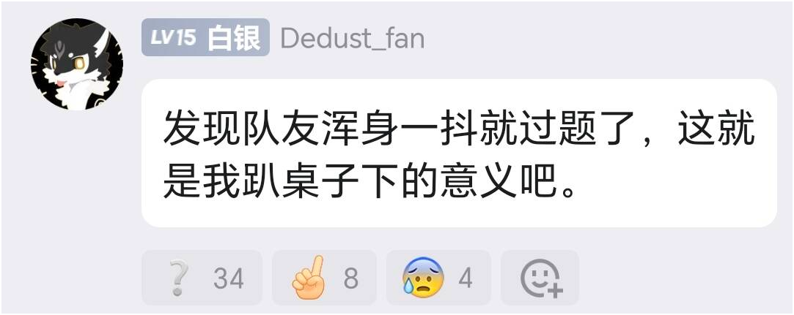
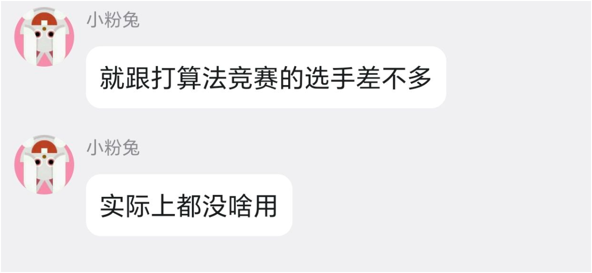

# 对于大多数人我不建议参加算法竞赛

先叠甲，本文章/视频仅代表个人拙见分享，不涉及攻击任何群体或者个人，如果阁下有所高见那一定是你对。

如果你点开了这个文章/视频，那想必你肯定是计算机相关专业学生或者想要了解参加算法比赛的同学。我以我个人经历给出建议：对于大多数同学，我是不建议你们去参加算法竞赛。

为什么？因为成为图灵派的概率会增加（doge）。

开个玩笑，说正经的，这个建议其实是我站在大四角度想给当初大一刚进校的我的一个建议。可能会有人说我是不是没参加过算法竞赛这样乱给建议，并非，我个人学校是一所中下水平的211院校的计算机科学与技术专业，获得过2025年ACM-ICPC亚洲区域赛铜牌、邀请赛铜牌、蓝桥杯省一。我不清楚大部分人对这样的奖项持一种什么样的态度，可能积极、可能消极，反正我自己觉得这样回过头来看看这些奖项感觉幼稚得可怜。

## 对于大部分人为什么我不建议参加算法竞赛？

我们做一些事总会有一定的目的，我们不妨基于目的导向来分析事物。打算法竞赛或者各类竞赛只是我们大学生活的一小部分，它包含在读大学这个主要事件里面，所以我们需要先分析读大学的目的。除开一部分真心想要深耕各类领域科研的人才（在目前高校科研环境下我很佩服这样的人），我相信绝大多数人读大学的目的都是找一份收入优渥、条件良好的工作，对吧。那么大部分人读大学的目的基本就可以和找一份好工作画等号。

有了这个结论，那么一个人合理状况下，读大学大部分行为都应该以找一份好工作为目的去做。

这个时候我们回到算法竞赛这块来看，大家所熟知的算法竞赛差不多就下面这几类，ACM-ICPC、蓝桥杯、CCF-CSP等级测试、天梯赛、或者你说数学建模也沾得上一点点边。那自然就会有一个疑问，参加这些算法竞赛在当前这个环境下面真的对找一份好工作有帮助吗？

我的回答是有也没有
从近5年整体专业风向来看，这几类竞赛，能有认可度也能有也只有ACM了（PS：区域赛银牌以上），其他的比赛在算法交流群里面都上不了台面，蓝桥杯不叫蓝桥杯叫花300大洋做慈善，
如果你说你参加acm拿到金牌参加EC-final又拿到金牌甚至说你去参加world final获奖了，那确实对找工作非常有帮助，那大厂巴不得你赶紧过去，这含金量杠杠的；但你要是说你就一个ACM区域赛铜牌，这个可能真没多大帮助，顶多是简历上面奖项方面能多写一行，或者对你大厂面试算法题手撕有些帮助。我另一个室友就是ACM区域赛和CCPC国赛银牌，照样处于找不到工作状态。你要说蓝桥杯或者其他的比赛得奖人数挺多的，我只能说这里面水分多的吓人，就和你去菜市场买菜买个牛肉能注水一样多，甚至数学建模之类的比赛都能花钱买题解AI改改都能得国奖，而且人人都有一个奖不就和人人都没奖一个样吗。大部分人参加算法竞赛，其实都很难拿到比较含金量比较高的奖项，大多都是混个铜牌甚至打铁，有可能校选中连去区域赛的资格都混不上。

有人可能会说参加这种比赛对保研很有帮助，你这个说法确实是正确的，许多学校在保研方面都是有竞赛加分这项的，但是这个我们的目的一样吗？我们的目的是找一份好工作，许多人读研出来也是想学历好看一点找工作好找，对吧，而且硕士出来肯定有一些比较拿得出手的项目或者论文用来找工作，难不成你硕士出来面试就逮着HR说自己当时算法竞赛拿银牌、铜牌、打铁的经历？所以算法竞赛拿个一般奖项对保研有用不代表竞赛对找工作有用，而且这还要看每个学校保研政策，我们学校acm算b类竞赛保研加分还没有互联网+和挑战赛加分多，也是整笑了。

到目前为止我给出了我不推荐大部分人参加算法竞赛最主要的原因，对未来找工作没有帮助。直接表象就是拿不到一个非常高的奖项，但我不推荐参加算法竞赛的深层原因还有几点。

### 第一点

我感觉算法竞赛培养的思维和主流工作上的工程思维不同。”不要重复造轮子“我觉得这是计算机行业工程上的主流思维，意思就是针对某问题如果别人已经解决并给出解决方案了，不要针对相同问题从0到1重复造相同的”轮子“而是直接使用别人的”轮子“并根据不同情况进行优化调整。而算法竞赛则着重培养你对一个特定问题从0到1造出特定”轮子“的能力。我们必须承认”重复造轮子“过程中我们能对问题有更加深刻的理解，放在十几年前可能你需要对重复造轮子方面多少掌握一点，当时手搓代码时代造轮子是一项基本功，但LLM和Agent的出现让这种基本功逐渐淡化，你想要实现什么算法直接丢给codex，claude code这类工具，它们写的比你更加完美，工作更多要的是复用”轮子“和产出idea而很少需要你造特殊的”轮子“。

### 第二点

算法竞赛投入时间性价比低。上一点我已经阐明了竞赛和工作思维上的不同，那么如果你花费大量时间在算法竞赛上面，这些时间不会对你工作技术栈产生帮助，而技术栈又是我们大学非常稀缺的东西，这对找工作可以说至关重要。需要明确的是技术栈这个东西，大学课程绝对不会深入教，你指望那些教授念着比你年纪还大的ppt教你实际工作需要的知识？别扯淡了。就拿我们学校来说，专业统一只教c++，结果大三软件开发让我们使用springboot，???，excuse me？ 我请问了那我们学c++干嘛用的，你也没教过java啊。这就是一个211院校计算机专业的培养方案课程，不成体系，很难深入，与时代脱节至少5-10年，我们学校计算机专业连个LLM和agent相关课程都没有。

有点扯远了，回到主题。我们个人时间是有限的，而技术栈和算法能力都是需要长时间来培养的技能，鱼和熊掌不可得兼，天道酬勤在算法竞赛里并不是一直适用，对大部分人来说你的算法能力和你的投入并不是成正相关的，而是到某个阶段就到瓶颈了，我个人在codeforces上面也就是1600左右水平，而去年训练出来的ai做算法题都能到1800左右水平，着实让我忍俊不禁。

### 第三点

学校支持程度不同。我相信不是每个学校都非常重视ACM这类算法竞赛，反正我们学校是这样的，你打A不如去打CTF。我们学校ACM名额不多而且没有老师带队，就这样也就算了，学校在2024年之前ACM都算正常。然后2025年这一年指导老师不知道和学院财务部发了什么疯，导致学校财务部把ACM社团经费砍掉了，指导老师也跑路了，2025年所有打比赛的队伍都只能自费参加，之前24年时候我们机票、住宿、参赛费用都是报销的，结果25年自费，让我当时一个多月钱袋干瘪。单参赛费，区域赛是1500元左右，加上机票住宿，大概总额在2000-3000左右，不过是3个人摊。区域赛队伍要么是报销，要么是自费参加，不过像我们这种前一年还报销第二年变成自费的还是头一个。

就算上面的问题你都能接受并且你很有实力，但ACM这类并不是一个人参赛，而是三个这就意味着如果你学校打A氛围不浓厚，想找到适合的队友还是蛮难的，一拖二去打比赛，别到时候真的成调侃中，队友端茶倒水当杯子了。

需要明确一下，我上面所有观点仅针对算法竞赛，不针对算法，我认为算法还是很有用的，但是算法竞赛真没什么用，而且并不是我一个人这么觉得。我更认为它是强者的甜点，而不是弱者证明自己的好途径。对于天赋哥而言，算法比赛可能只是他们在学习技术栈的算法这块比较深入的拓展罢了，但是天赋哥注定是少数。如果你想看看自己有没有天赋，可以先去全力学习一两周算法然后去cf上面打一场div2，大概就能知道自己是什么水平了。

我还是建议大家不要听一些网上言论说什么大学多参加竞赛啊，竞赛怎么怎么好就一股脑不假思索的去了，去之前起码先看看这个人是不是卖课的。别到时候一看这个人是卖算法课的。还是基于目的导向分析，卖课的和你说算法竞赛好是真为了你能更加优秀吗？妈的，还不是看上你兜里的卖课钱了？目前网上所有卖课都是一个样让你关注或者加公众号然后分享都是有私心的，真要分享直接就有github或者博客链接了。

我个人觉得与其打算法竞赛，想找工作的同学不如在大一大二多学点技术栈早点去找实习；想保研的同学不如多卷卷绩点，多在校内找找老师去发几篇会议，多看看学校保研计划再做安排。

本文章/视频是根据个人经历撰写录制，带有一定参考性，但也有部分情绪化主观描述，还请各位道友根据自身真实情况实事求是分析后作为参考。人啊总是在向过去看得时候能讲一堆失败经验。

如果你听到这里还坚定地想打算法，那你一定很热爱算法，不用管我之前的消极言论做自己喜欢的事情最重要。

看到这里祝各位学习工作顺利，身体健康

